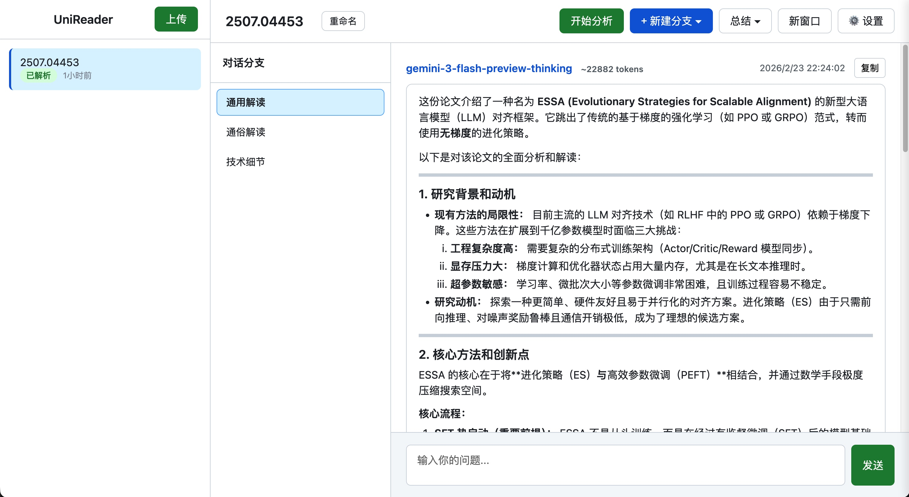
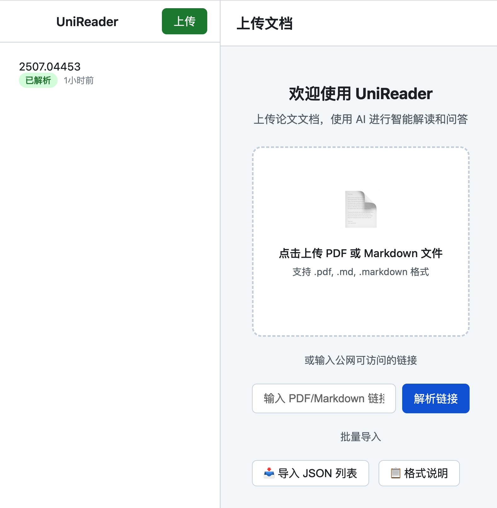
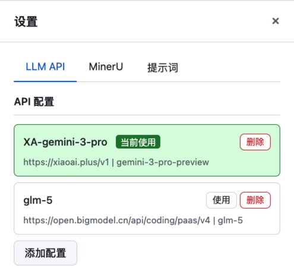
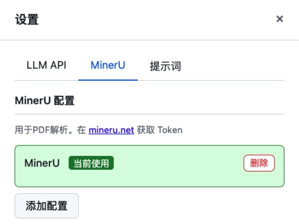
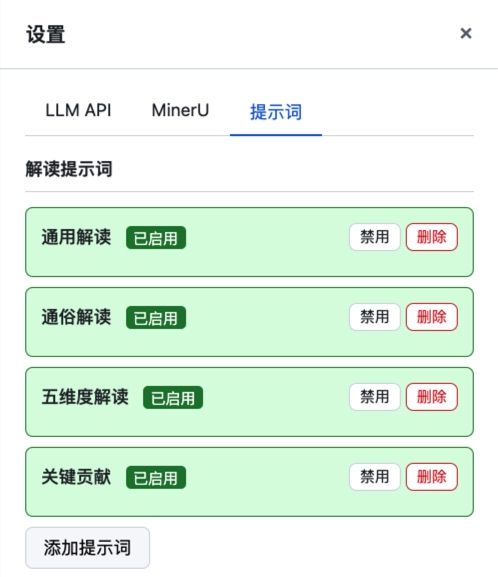

# UniReader - 功能与操作指南

本文档详细介绍论文阅读助手的各项功能及操作方法。

## 目录

- [快速开始](#快速开始)
- [界面说明](#界面说明)
- [上传论文](#上传论文)
- [论文解析](#论文解析)
- [论文解读](#论文解读)
- [对话问答](#对话问答)
- [分支管理](#分支管理)
- [批量导入](#批量导入)
- [配置管理](#配置管理)
- [高级功能](#高级功能)

---

## 快速开始

1. 启动服务：`python run.py`
2. 打开浏览器访问 `http://localhost:8000`
3. 配置 LLM API（首次使用需要）
4. 上传论文或输入 URL
5. 点击"开始分析"进行论文解读

---

## 界面说明

### 整体布局


### 区域功能

| 区域 | 功能 |
|------|------|
| 左侧边栏 | 论文列表管理，支持上传、导入、删除论文 |
| 中间面板 | 分支列表，每个分支代表一个独立的对话上下文 |
| 右侧主区域 | 对话消息展示和输入，支持 Markdown 和公式渲染 |

---

## 上传论文



### 方式一：本地上传

1. 点击左侧边栏底部的 **"上传文件"** 按钮
2. 选择 PDF 或 Markdown 文件
3. 等待上传完成

> 支持的文件格式：`.pdf`, `.md`, `.markdown`

### 方式二：URL 解析

1. 点击左侧边栏底部的 **"从 URL 导入"** 按钮
2. 输入公网可访问的 PDF/Markdown 链接，如`https://arxiv.org/pdf/2507.04453`
3. 点击确认，等待解析完成

> 推荐使用公网 URL，可获得更好的解析效果（MinerU 支持公式、表格识别）
> 注意使用在线解析的时候关闭VPN

### 方式三：批量导入

1. 点击 **"导入 JSON 列表"** 按钮
2. 选择包含论文链接的 JSON 文件
3. 确认导入数量后开始批量处理

详见 [批量导入](#批量导入) 章节。

---

## 论文解析

上传 PDF 后，系统会自动进行解析：

### 解析流程

```
上传 PDF → 下载备份 → 提交解析任务 → 等待处理 → 解析完成 → 提取标题
```

### 解析状态

| 状态 | 说明 |
|------|------|
| 任务已创建 | 解析任务已提交到 MinerU |
| 排队中 | 任务等待处理 |
| 正在解析 | 正在处理 PDF（显示进度） |
| 正在转换 | 正在生成 Markdown |
| 解析完成 | 解析成功，可以进行下一步 |

### 自动功能

1. **PDF 备份**：原始 PDF 会自动下载到本地保存
2. **Markdown 存储**：解析结果保存为 `.md` 文件
3. **标题提取**：系统会调用 LLM 自动提取论文标题

### 切换解析方式

如果 MinerU 解析失败或太慢，可以点击 **"使用本地解析"** 按钮切换到 PyMuPDF 本地解析。

---

## 论文解读

### 开始分析

1. 解析完成后，点击 **"开始分析"** 按钮
2. 系统会根据预设的提示词并行创建多个解读分支
3. 每个分支展示不同角度的解读内容

### 解读角度（默认）

| 角度 | 说明 |
|------|------|
| 通用解读 | 全面的论文概览 |
| 通俗解读 | 用简单语言解释复杂概念 |
| 五维度解读 | 从五个维度综合解读 |
| 关键贡献 | 分析论文的创新贡献 |


### 自定义提示词

在配置面板中可以添加自定义解读提示词：

1. 点击右上角 **"配置"** 按钮
2. 切换到 **"提示词"** 标签
3. 点击 **"添加提示词"**
4. 填写名称和提示词内容
5. 保存后，新提示词会在下次分析时生效

---

## 对话问答

### 基本操作

1. 选择一个分支
2. 在底部输入框输入问题
3. 按 Enter 或点击发送
4. AI 会基于论文内容回答

### 对话特点

- **上下文保持**：对话基于论文全文和之前的对话历史
- **引用支持**：AI 会引用论文中的相关内容
- **流式输出**：回答实时显示，打字机效果

### 停止生成

如果回答过长或不需要继续，点击消息中的 **"停止"** 按钮即可中断生成。

---

## 分支管理

### 什么是分支？

每个分支是一个独立的对话上下文，用于：
- 不同角度的论文解读
- 不同问题的讨论
- 区分不同主题的对话

### 新建分支

1. 解析完成后，点击 **"+ 新建分支"** 按钮
2. 输入分支名称
3. 选择是否预加载文档上下文：
   - **确定**：分支会包含文档全文，AI 能更好理解上下文
   - **取消**：创建空白分支，适合不需要论文全文的对话

### 删除分支

1. 将鼠标悬停在分支上
2. 点击出现的 **"删除"** 按钮
3. 确认删除

> 注意：至少需要保留一个分支

### 分支总结

1. 选择要总结的分支
2. 点击 **"总结分支"** 按钮
3. 系统会生成当前分支对话的总结

### 总结全部

点击 **"总结全部"** 按钮，系统会汇总所有分支的讨论要点。

---

## 批量导入

### JSON 格式

支持两种格式：

**简单数组格式：**
```json
[
  "https://arxiv.org/pdf/2301.12345",
  "https://arxiv.org/pdf/2301.12346",
  "https://arxiv.org/abs/2301.12347"
]
```

**详细对象格式：**
```json
[
  {
    "link": "https://arxiv.org/abs/2301.12345",
    "title": "论文标题（可选）"
  },
  {
    "link": "https://openreview.net/forum?id=xxxx",
    "title": "另一篇论文"
  }
]
```

### URL 自动转换

系统会自动转换以下链接格式：

| 原格式 | 转换后 |
|--------|--------|
| `arxiv.org/abs/XXX` | `arxiv.org/pdf/XXX` |
| `openreview.net/forum?id=XXX` | `openreview.net/pdf?id=XXX` |
| `aclanthology.org/XXX/` | `aclanthology.org/XXX.pdf` |

### 导入过程

1. 选择 JSON 文件
2. 系统解析并显示发现的论文数量
3. 确认后开始并发导入
4. 实时显示进度和结果
5. 完成后显示成功/失败统计

### 并发控制

并发数受配置文件中 `client.max_concurrent_requests` 限制，可在 `config.yaml` 中调整。

---

## 配置管理

### 打开配置面板

点击右上角的 **"设置"** 按钮。

### LLM API 配置


必需配置，用于调用大语言模型。

| 字段 | 说明 |
|------|------|
| 名称 | 配置显示名称 |
| API 地址 | 如 `https://api.openai.com/v1` |
| API 密钥 | 你的 API Key |
| 模型 | 使用的模型名称 |

**常用 API 配置示例：**

```yaml
# OpenAI
base_url: "https://api.openai.com/v1"
model: "gpt-4"

# DeepSeek
base_url: "https://api.deepseek.com/v1"
model: "deepseek-chat"

# Claude (通过 OpenAI 兼容接口)
base_url: "https://api.anthropic.com/v1"
model: "claude-3-opus-20240229"

# 本地模型 (如 Ollama)
base_url: "http://localhost:11434/v1"
model: "llama2"
```

### MinerU 配置

可选配置，提供高质量 PDF 解析。

1. 访问 [https://mineru.net](https://mineru.net) 注册账号
2. 获取 Token
3. 在配置面板填入 Token


> 不配置时，系统会使用本地 PyMuPDF 解析

### 提示词配置


可以添加、编辑、启用/禁用解读提示词。

---

## 高级功能

### 切换文档保持状态

切换到另一篇论文时，之前的对话状态会被保存，再次切换回来时会恢复。

### 编辑论文标题

1. 点击论文列表中的论文名旁的编辑图标
2. 或在主界面点击标题旁的编辑按钮
3. 输入新标题

### 导出数据

所有数据存储在 `data/papers/` 目录下，可以直接复制备份：

```
data/papers/{paper_id}/
├── xxx.pdf      # 原始 PDF
├── content.md        # 解析内容
├── session.json      # 会话状态
└── conversation.json # 对话记录
```

### 配置文件说明

`config.yaml` 完整配置项：

```yaml
llm_apis:
  - name: "API 名称"
    base_url: "API 地址"
    api_key: "密钥"
    model: "模型名"
    is_default: true

mineru:
  - name: "MinerU"
    token: "your-token"
    is_default: true

prompts:
  - name: "提示词名称"
    prompt: |
      提示词内容...
    is_enabled: true

server:
  host: "0.0.0.0"
  port: 8000
  file_server_port: 8765

client:
  max_concurrent_requests: 3    # 最大并发请求数
  batch_import_delay: 1         # 批量导入间隔(秒)
  request_timeout: 120          # 请求超时(秒)
```

---

## 常见问题

### Q: PDF 解析失败怎么办？

1. 优先使用公网 URL（如 arXiv 链接）
2. 检查 MinerU Token 是否正确
3. 点击"使用本地解析"切换到 PyMuPDF

### Q: 标题提取不准确？

标题由 LLM 自动提取，可能存在误差。可以手动编辑标题进行修正。

### Q: 如何备份数据？

复制 `data/` 目录即可备份所有论文和对话记录。

### Q: 公式渲染不正确？

1. 推荐使用 MinerU 解析（对公式支持更好）
2. 本地解析器对复杂公式支持有限

### Q: 批量导入部分失败？

查看失败列表中的错误信息，可能是：
- URL 无法访问
- 文件格式不支持
- 网络超时

---

## 快捷操作

| 操作 | 方法 |
|------|------|
| 切换论文 | 点击论文列表中的论文 |
| 切换分支 | 点击分支列表中的分支 |
| 删除论文 | 悬停论文 → 点击删除图标 |
| 删除分支 | 悬停分支 → 点击删除 |
| 编辑标题 | 点击标题旁的编辑按钮 |
| 发送消息 | 输入后按 Enter |
| 停止生成 | 点击"停止"按钮 |

---

