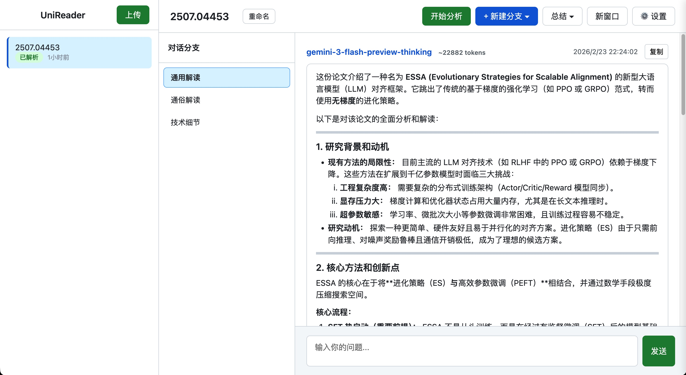
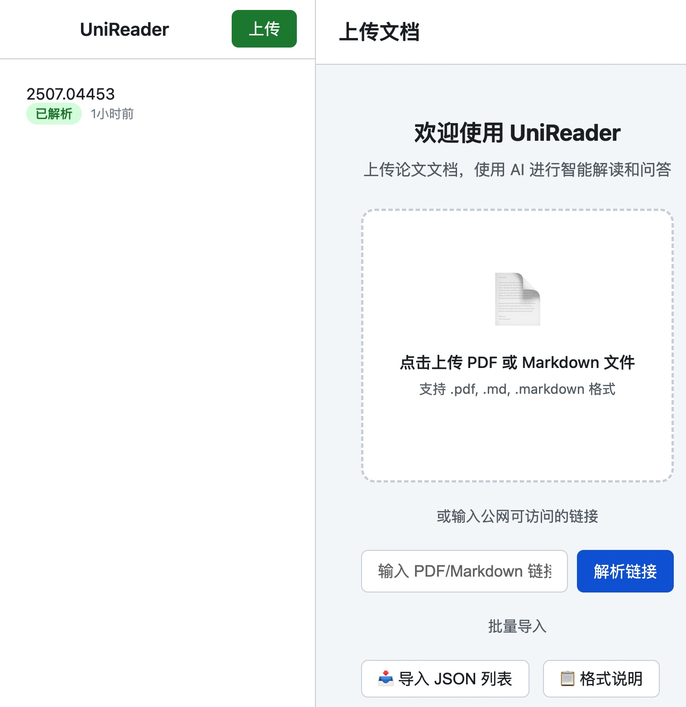
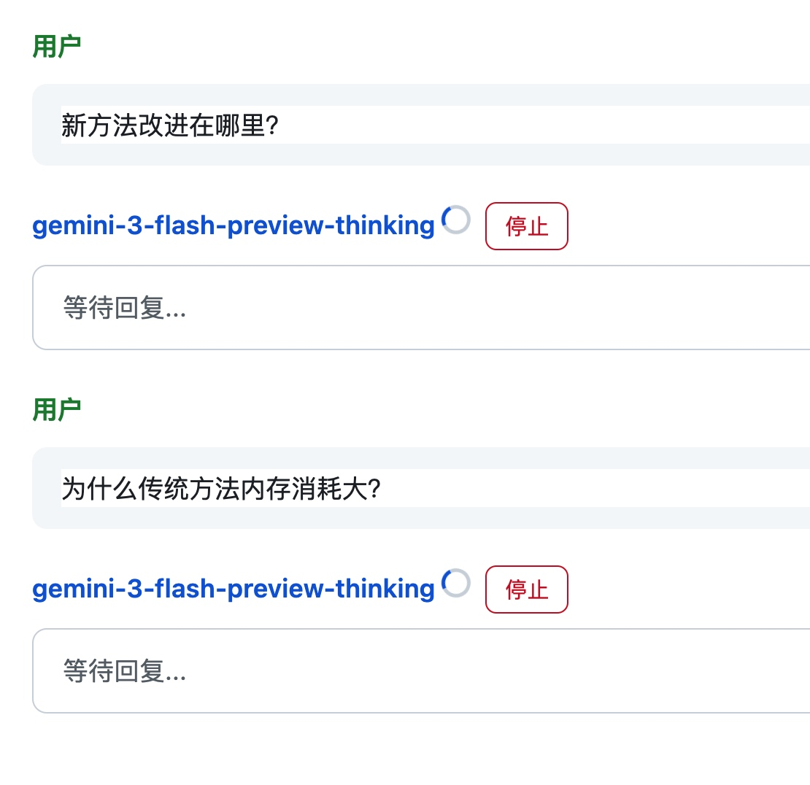

# UniReader

一个基于大语言模型的智能论文阅读助手，支持 PDF/Markdown 文档解析、多角度论文解读、并行提问请求、分支式对话管理。


## ✨ 功能特点

### 📄 智能文档解析
- 支持 PDF 和 Markdown 文件上传
- 支持公网 URL 直接解析（arXiv、OpenReview 等）
- MinerU API 高质量 PDF 解析（支持公式、表格识别）
- 本地 PyMuPDF 解析作为备选方案
- 自动提取论文标题


### 🤖 多角度论文解读
- 预设多种解读提示词（通用解读、通俗解读、技术细节等）
- 可自定义添加解读模板
- 并行请求多个解读角度，提高效率



### 💬 分支式对话管理
- 每个解读角度独立分支，互不干扰
- 支持基于解读内容继续提问
- 支持分支总结和汇总
- 支持新建空白分支或带文档上下文的分支
- 可在新窗口查看对话（实时同步）

### 📦 批量导入
- 支持 JSON 格式批量导入论文列表
- 自动转换 arXiv/OpenReview 链接
- 并发导入，显示进度

### 🎨 友好的交互体验
- 实时流式输出，打字机效果
- Markdown 渲染（支持代码高亮）
- KaTeX 数学公式渲染
- 停止生成、重新生成功能
- 切换文档时保持对话状态
- 深色模式支持

## 🚀 快速开始

### 方式一：下载发布版本（推荐）

前往 [Releases](https://github.com/hydeng97/UniReader/releases) 页面下载对应平台版本：

- **Windows**: 下载 `UniReader-Windows.zip`，解压后运行 `UniReader.exe`
- **macOS**: 下载 `UniReader-macOS.tar.gz`，解压后运行 `UniReader`
- **Linux**: 下载 `UniReader-Linux.tar.gz`，解压后运行 `UniReader`

首次运行会自动创建 `config.yaml` 配置文件。

### 方式二：从源码运行

#### 环境要求
- Python 3.10+
- pip 或 conda

#### 安装步骤

```bash
# 克隆项目
git clone https://github.com/hydeng97/UniReader.git
cd UniReader

# 创建虚拟环境（推荐）
python -m venv .venv
source .venv/bin/activate  # Linux/macOS
# .venv\Scripts\activate  # Windows

# 安装依赖
pip install -r requirements.txt

# 配置
cp config.yaml.template config.yaml
# 编辑 config.yaml，填入您的 API Key

# 运行
python run.py
```

访问 http://localhost:8000 开始使用。
具体使用方法参考GUIDE.md
## ⚙️ 配置说明

### LLM API 配置

支持多种兼容 OpenAI 格式的 API：

```yaml
llm_apis:
  - name: "OpenAI"
    base_url: "https://api.openai.com/v1"
    api_key: "sk-xxx"
    model: "gpt-4"
    is_default: true
  
  - name: "DeepSeek"
    base_url: "https://api.deepseek.com/v1"
    api_key: "sk-xxx"
    model: "deepseek-chat"
```

### MinerU 配置（可选）

MinerU 提供高质量的 PDF 解析服务：

```yaml
mineru:
  - name: "MinerU"
    token: "your-token"  # 从 https://mineru.net 获取
    is_default: true
```

如不配置，系统会使用本地 PyMuPDF 解析。

### 提示词配置

可自定义论文解读提示词：

```yaml
prompts:
  - name: "我的解读"
    prompt: |
      请从以下角度解读这篇论文...
    is_enabled: true
```

## 🔧 开发

### 本地开发

```bash
# 安装依赖
pip install -r requirements.txt

# 运行开发服务器
python run.py
```

### 构建

```bash
# macOS/Linux
python build.py

# Windows
build.bat
```

## ❓ 常见问题

### PDF 解析失败？
1. 推荐使用公网可访问的 PDF URL（如 arXiv 链接）
2. 检查 MinerU Token 是否正确配置
3. 系统会自动回退到本地解析器

### 如何添加新的 LLM API？
在设置页面或 `config.yaml` 中添加，确保 `base_url` 符合 OpenAI API 格式。

### 如何备份数据？
复制 `data/` 目录即可备份所有论文和对话记录。

## 📄 许可证

[MIT License](LICENSE)

## 🤝 贡献

欢迎提交 Issue 和 Pull Request！

---

**UniReader** - 让论文阅读更高效 📚
